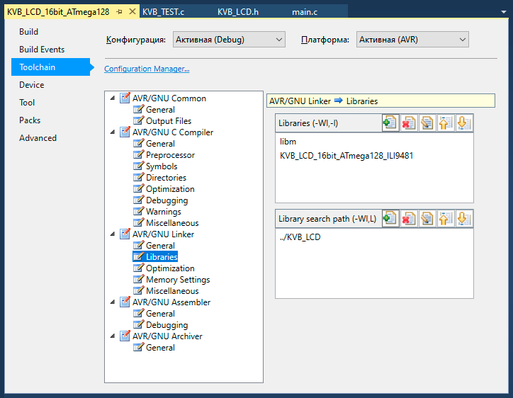

# KVB_LCD Graphics Library
## 🌐 Как подключить библиотеку (.a) к проекту в Atmel Studio 7.0
Графические библиотеки (**.a**) для **LCD** панелей лежат в папке проекта **KVB_LCD**, там же лежит **GUI** и файлы презентации (**.c** и **.h**).
## 📂 Обзор структуры файлов
* **KVB_LCD.h** – GUI графический интерфейс пользователя.
* **KVB_TEST.h** – Заголовочный файл с двумя функциями презентации в зависимости от разрешения.
* **KVB_TEST.c** – Исполняемый файл с двумя функциями презентации в зависимости от разрешения.
* **KVB_TEXT.h** – Заголовочный файл текстовых переменных презентации.
* **KVB_TEXT.c** – Исполняемый файл текстовых переменных презентации.
* **libKVB_LCD_16bit_ATmega128_9325.a** – Файл библиотеки **LCD** панели **ILI9325** с разрешением **320 х 240**.
* **libKVB_LCD_16bit_ATmega128_9341.a** – Файл библиотеки **LCD** панели **ILI9341** с разрешением **320 х 240**.
* **libKVB_LCD_16bit_ATmega128_9481.a** – Файл библиотеки **LCD** панели **ILI9481** с разрешением **480 х 320**.
* **libKVB_LCD_16bit_ATmega128_9486.a** – Файл библиотеки **LCD** панели **ILI9486** с разрешением **480 х 320**.
* **libKVB_LCD_16bit_ATmega128_8009A.a** – Файл библиотеки **LCD** панели **OTM8009A** с разрешением **800 х 480**.

## ⚙️ Настройте Линкер (Линковщик):
* Откройте **Properties** конечного проекта (**Alt + F7**).
* Перейдите в **Toolchain -> AVR/GNU Linker -> Libraries**.
* В верхнем окне (**Libraries (-Wl,-l)**) нажмите + и введите имя вашей библиотеки **без** приставки **lib** и расширения (**.a**). То есть, если файл называется **libKVB_LCD_16bit_ATmega128_9481.a**, введите просто **KVB_LCD_16bit_ATmega128_9481**, обратите внимание, должна быть подключена только одна графическая библиотека в проекте.
* В нижнем окне (**Library search path (-L)**) нажмите **+** и укажите путь к папке, где физически лежит файл **libKVB_LCD_16bit_ATmega128_9481.a**.

* Теперь в файле **main.c** вашего конечного проекта вы должны снять комментарии с одной из двух функций презентации в зависимости от разрешения **LCD** панели (**lcd_Test480x320Landscape()** или **lcd_Test320x240Landscape()**).
При сборке **Atmel Studio 7.0** автоматически заберет скомпилированный код из файла библиотеки **libKVB_LCD_16bit_ATmega128_9481.a**.
