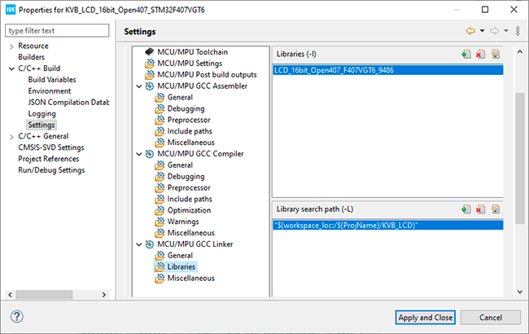

# KVB_LCD Graphics Library
## 🌐 Как подключить библиотеку (.a) к проекту в STM32CubeIDE
Графические библиотеки (**.a**) для **LCD** панелей лежат в папке проекта **KVB_LCD**, там же лежит **GUI** и файлы презентации (**.c** и **.h**).
## 📂 Обзор структуры файлов
* **KVB_LCD.h** – GUI графический интерфейс пользователя.
* **KVB_TEST.h** – Заголовочный файл с двумя функциями презентации в зависимости от разрешения.
* **KVB_TEST.c** – Исполняемый файл с двумя функциями презентации в зависимости от разрешения.
* **KVB_TEXT.h** – Заголовочный файл текстовых переменных презентации.
* **KVB_TEXT.c** – Исполняемый файл текстовых переменных презентации.
* **libLCD_16bit_Open407_F407VGT6_9325.a** – Файл библиотеки **LCD** панели **ILI9325** с разрешением **320 х 240**.
* **libLCD_16bit_Open407_F407VGT6_9341.a** – Файл библиотеки **LCD** панели **ILI9341** с разрешением **320 х 240**.
* **libLCD_16bit_Open407_F407VGT6_9481.a** – Файл библиотеки **LCD** панели **ILI9481** с разрешением **480 х 320**.
* **libLCD_16bit_Open407_F407VGT6_9486.a** – Файл библиотеки **LCD** панели **ILI9486** с разрешением **480 х 320**.
* **libLCD_16bit_Open407_F407VGT6_8009A.a** – Файл библиотеки **LCD** панели **OTM8009A** с разрешением **800 х 480**.
## ⚙️ Настройте Линкер (Линковщик) и GUI:
1. В проекте нажмите правой кнопкой мыши на корень **-> Properties -> C/C++ Build -> Settings ->** вкладка **Tool Settings**.
2. Спуститесь ниже к разделу **MCU GCC Linker** и нажмите на подпункт **Libraries**.
3. Вы увидите два окошка: **Libraries (-l)** (верхнее) и **Library search path (-L)** (нижнее).
4. В нижнее окошко **(Library search path -L)** добавьте путь к папке, где физически лежит ваш файл **libLCD_16bit_Open407_F407VGT6_9486.a**.
5. В верхнее окошко **(Libraries -l)** добавьте имя вашей библиотеки, но **СТРОГО БЕЗ** префикса **lib** и **БЕЗ** расширения **.a (LCD_16bit_Open407_F407VGT6_9486)**, обратите внимание, должна быть подключена только одна графическая библиотека в проекте.
6. Нажмите **Apply and Close**.

7. В файле графического интерфейса пользователя **KVB_LCD.h**, строка **120**, рас комментируйте только строку вашей **LCD** панели, там находится усредненная установка задержек шины **FSMC** панели, она зависит от конкретной реализации панели, длины проводников и шлейфа.
⚠️  **ВАЖНО!!!** Из за большой скорости передачи данных в **GRAM**, если установлен шлейф, надо **ОБЯЗАТЕЛЬНО** поставить гасящую отражения емкость **22 пф** на конце шлейфа, как можно ближе к разъему панели по сигналу записи **WE**.
8. Теперь в файле **main.c** вашего конечного проекта вы должны снять комментарии с одной из двух функций презентации в зависимости от разрешения **LCD** панели (**lcd_Test480x320Landscape()** или **lcd_Test320x240Landscape()**).
При сборке **STM32CubeIDE** автоматически заберет скомпилированный код из файла библиотеки **libLCD_16bit_Open407_F407VGT6_9486.a**.
