# KVB_LCD Graphics Library

## License
This graphics library is distributed under the **Creative Commons Attribution-NonCommercial 4.0 
International (CC BY-NC 4.0)** license.
You are free to use, modify, and distribute this code for personal, educational, and 
non-commercial purposes, provided that proper author attribution is given. Use of this 
library in any commercial projects is strictly prohibited. For inquiries regarding the 
acquisition of a commercial license, please contact: 
**[email kboruzdov@mail.ru tel +7 965-363-45-29]**.

## Intellectual Property Protection and Proprietary Algorithms
The mathematical solutions and algorithms implemented within the library's graphics core 
are the exclusive intellectual property of the author. Specifically, the proprietary 
algorithm for on-the-fly rendering and gradient filling of circular/three-surface objects, 
executed purely via **integer math** (without utilizing a frame buffer), represents closed, 
protected know-how.

To protect copyright and prevent unauthorized replication of these unique, low-level 
engineering solutions, the graphics core is distributed **strictly as precompiled, 
closed-source binary modules** (static library files in `.a` and `.lib` formats).

Under **no circumstances** shall the source code of the mathematical core (including 
high-speed line rendering, GRAM gradient calculation, and three-surface object algorithms) 
be disclosed or transferred, regardless of the commercial license type acquired. 
However, the developer receives full access to the source code of the GUI interface layer 
(`KVB_LCD.h`), display drivers, and demonstration projects, ensuring complete flexibility 
for integration and custom user interface development.

## Cross-Platform Compatibility
The library is written completely from scratch in pure C using **GCC** and **AC6**, without 
utilizing any third-party code, and relies exclusively on integer math. Currently, the 
library supports two microcontrollers—**ATmega128** and **STM32F407**—at the Graphical User 
Interface (GUI) layer (**KVB_LCD.h**). Graphical objects developed using the GUI library 
will function identically on both the 8-bit **ATmega128** microcontroller and the 32-bit 
**STM32F407**. 

For software development, the library supports three development environments (IDEs): 
**Atmel Studio 7.0**, **STM32CubeIDE v2**, and **Keil MDK v5.43**. To evaluate the test 
presentation code on the STM32, three development boards featuring an FSMC interface 
are supported:
* **Open407V-D stm32f4-discovery** based on the **STM32F407VGT6** microcontroller.
* **ST STM32F4XX Black v3.0 1606** based on the **STM32F407ZGT6** microcontroller.
* **ST STM32F4XX Black v2.0 1509** based on the **STM32F407VET6** microcontroller.

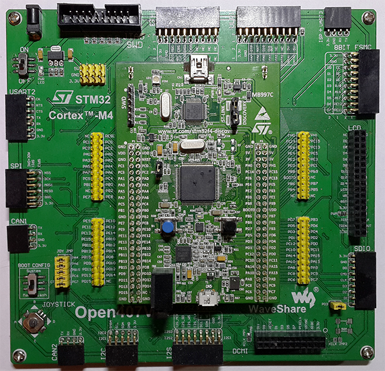
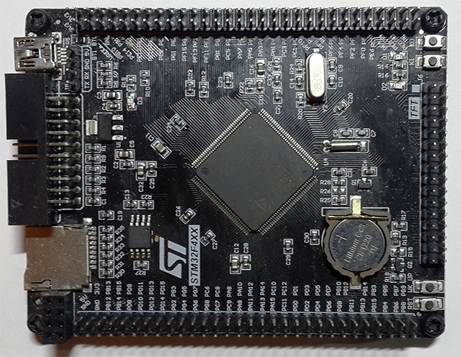
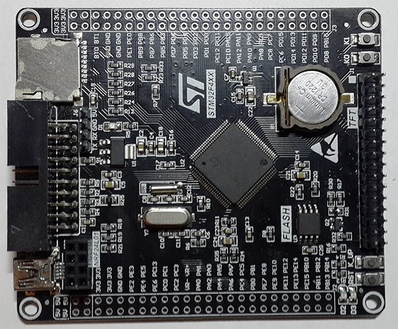

To run the test presentation code on the **ATmega128**, the following hardware I/O ports 
are utilized:
* **PORTC** port (D0-D7): Low byte of the **LCD** panel data bus.
* **PORTA** port (D8-D15): High byte of the **LCD** panel data bus.
* **PORTD** pin 4 (**CS**): Transmits the **LCD** panel access signal.
* **PORTD** pin 5 (**RD**): Transmits the **LCD** panel read signal.
* **PORTD** pin 6 (**WR**): Transmits the **LCD** panel write signal.
* **PORTD** pin 7 (**RS**): Transmits the **LCD** panel command/data signal.
* **PORTG** pin 0 (**RST**): Transmits the **LCD** panel reset signal.
* **PORTG** pin 1 (**BL**): Transmits the **LCD** panel backlight signal.

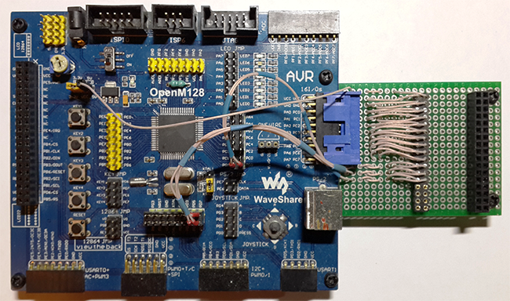

## Unique Functionality and Proprietary Algorithms
In addition to cross-platform compatibility, the primary objective during the library's 
creation was achieving the fastest possible rendering speed for graphical objects. Unlike 
conventional libraries that rely on standard pixel-by-pixel output, this project implements 
optimized proprietary algorithms designed specifically around the Graphics RAM (**GRAM**) 
architecture of LCD displays:
* **High-Speed Line Rendering.** Utilizes a proprietary algorithm that calculates continuous 
  straight segments within inclined/diagonal lines. This minimizes the number of **GRAM** 
  address switching commands sent to the **LCD** panel and enables rapid block filling, 
  which exponentially increases the rendering speed and **FPS**.
* **Gradient Color Rendering.** Features a proprietary algorithm that computes and executes 
  gradient shading in both vertical and horizontal directions with linear or central 
  orientation, leveraging the hardware acceleration capabilities of the **GRAM** matrix 
  of the **LCD** panel.
* **Multifunctional Three-Surface Object.** Uses a proprietary algorithm that calculates a 
  gradient-filled circle on the fly using purely integer math without utilizing framebuffers. 
  This object dynamically calculates and renders three rounded, circular, or rectangular 
  surfaces simultaneously with gradient fills in different directions on the fly. All three 
  surfaces are independent and can be redrawn separately. This allows the GUI to emphasize 
  an active object by redrawing only one outer surface with a different color, saving 
  processing time by not rendering the remaining surfaces.

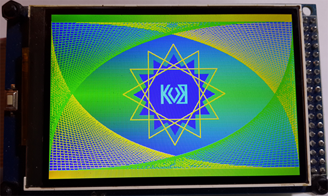
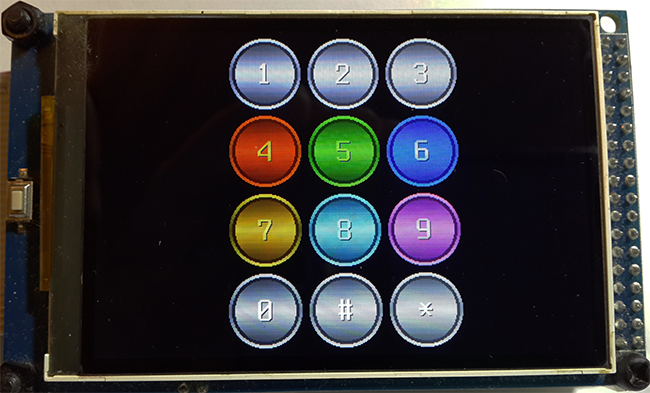
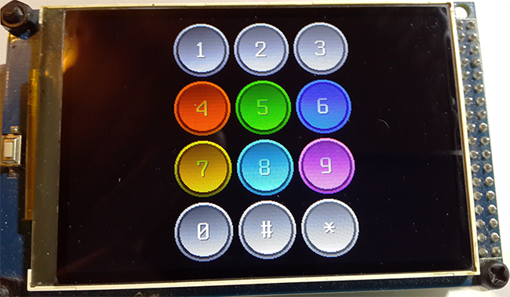

## Graphical Primitives
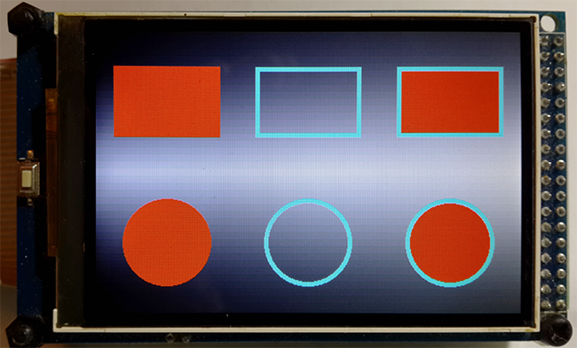
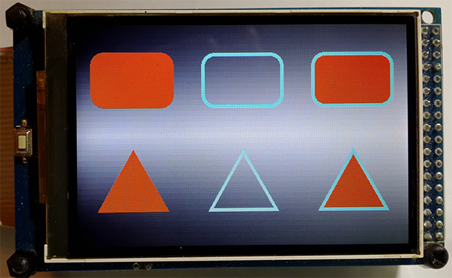
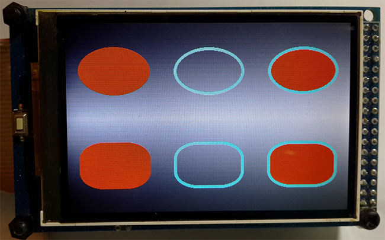

* **Three Display Modes and Adjustable Borders.** Graphical primitives feature two independent 
  surfaces and three display modes: 1 = the entire primitive, 2 = adjustable border only, 
  3 = inner surface only. This allows users to select an object on the **LCD** panel by simply 
  changing its border color, avoiding the time-consuming process of redrawing its internal 
  area. Triangle primitives (both equilateral and isosceles) support four vertex 
  orientations: 1 = left, 2 = right, 3 = up, 4 = down.

## Advanced Text Rendering Subsystem
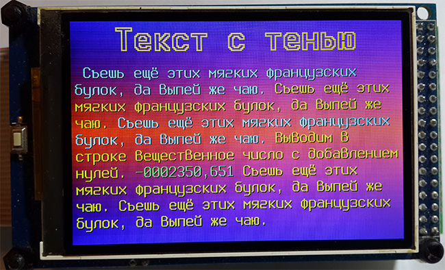
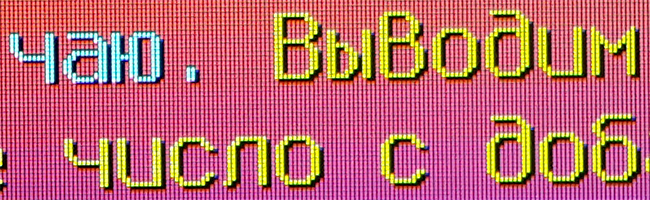
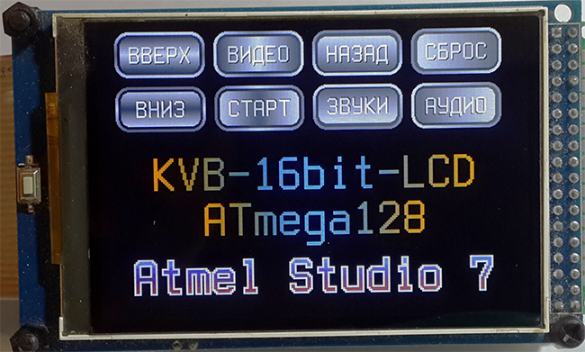

The text engine features powerful and fast text handling capabilities, automatically aligning 
text strings and rendering complex visual effects on the fly without a framebuffer:
* **Baseline Alignment.** All fonts align to a single horizontal guide line (the lower shelf 
  of characters). This enables developers to compose a single line of text out of words with 
  different sizes and colors, guaranteeing flawless text alignment.
* **Automatic Word Wrapping.** Long, continuous text streams can consist of multiple string, 
  integer, and float variables of various font sizes and colors. The text automatically wraps 
  by word to the next line if it exceeds the specified width of the text block.
* **Tabulation Support.**
* **Font Kerning Settings** (character spacing) with precise adjustment for space and 
  tab lengths.
* **Line Spacing.** Line spacing can be adjusted in both positive and negative directions. 
  Negative spacing is highly effective when a long text block is output entirely in uppercase 
  characters, while increasing it in the positive direction enhances text readability.
* **Font Scale Factor.**
* **Text Alignment.** Supports text alignment to the left edge, right edge, or center.
* **Shadow Effect.** Text character shadows feature four configuration settings: 1 = bottom-right 
  shadow, 2 = bottom-left shadow, 3 = top-right shadow, 4 = top-left shadow. This creates a 
  raised or embossed text effect, significantly improving readability.
* **Circular Character Outline.** Draws a crisp, sharp outline around each character, ensuring 
  legibility against any background. The engine can also display only the outline without 
  rendering the inner character.
* **Gradient Text.** Delivers smooth horizontal or vertical color blending via linear or central 
  text line fills, which can be combined with shadows or circular outlines.

## Distribution Format and Source Code Availability
The graphics core of the library is supplied as precompiled, closed-source static libraries, 
ensuring the protection of the proprietary algorithms:
* **For STM32F407:** Static library files in **.a** format (for STM32CubeIDE) and **.lib** 
  format (for Keil MDK).
* **For ATmega128:** Static library files in **.a** format (for Atmel Studio 7.0).

What remains fully open to the developer:
* The main GUI interface header file—**KVB_LCD.h**. It features exhaustive comments in Russian, 
  providing detailed descriptions of all functions, parameters, font effects, and graphical 
  objects.
* The entire demo code pack includes comprehensive Russian comments to ensure a quick start.

## Graphical Font Editor (Windows IDE)
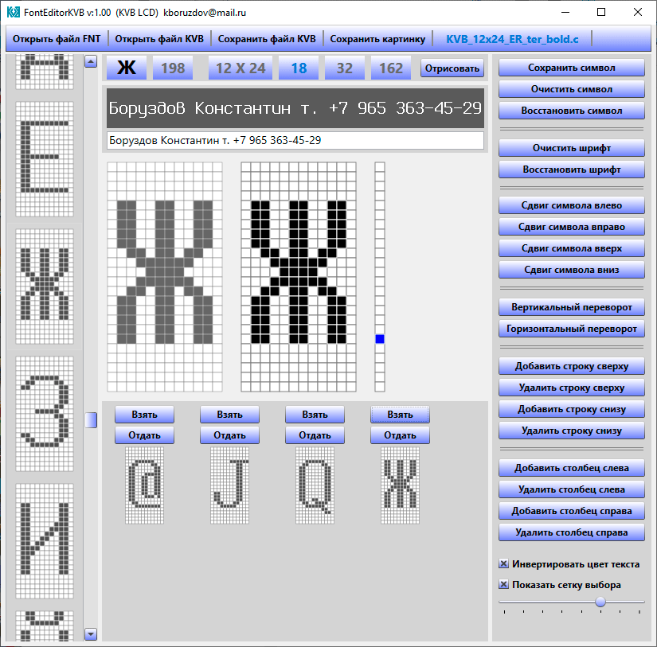

A dedicated, fully-featured Windows application was developed to create and customize 
on-screen fonts, automating the entire cycle of graphical resource preparation:
* **DOS Font Import (.fnt).** A vast number of bitmap fonts were created in the .fnt format 
  during the DOS era. The editor allows quick loading of these classic DOS bitmap fonts for 
  subsequent adaptation to microcontroller displays.
* **Pixel-by-Pixel Editing.** Provides a user-friendly GUI for manual drawing, modifying 
  individual characters on a pixel grid, and adjusting font metrics.
* **Interactive Rendering.** Displays a specified text string on the fly in real-time. You 
  can instantly see how modifying a single pixel in a character affects the layout of the 
  entire text line.
* **Export to C Format.** Generates ready-to-use **.c** source files featuring an ultra-compact 
  sequential data packing method (a **9x16** character occupies just 18 bytes), fully compatible 
  with both **PROGMEM** in the **ATmega128** Flash memory and standard constant arrays in 
  the **STM32F407**.
* **Proprietary Font Pack.** Using this editor, 23 unique Russian-English fonts have been 
  created (5 base fonts are included in the presentation for demonstration purposes; the 
  full set and the editor are available upon request).

You can watch the video on RUTUBE to evaluate the performance:
https://rutube.ru/video/80140af8b045d20b939240ea3dab1d8b/

*Note: In the demonstration version of the editor, the option to save in C-format is 
disabled; the full version of the editor is available upon request.*
